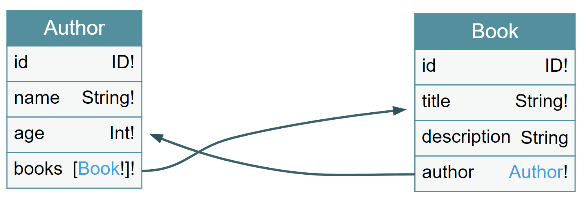

# GraphQLによるDoS攻撃

## 概要

GraphQLはデータ構造に対するクエリ言語であるため、複数のフィールドを組み合わせて巨大なノードを要求するクエリを発行することができます。

```graphql
query{
	regions (limit: 1000){
		teams (limit: 1000){
			users (limit: 1000) {
				name
			}
		}
	}
}
```

要求クエリの条件を満たすデータが十分に存在している場合、取得ノード数が指数関数的に増加します。

また、しばしば再帰的にデータ構造が参照可能な状態になることがあります。

member コンポーネントは、その所属するチーム情報(team)を取得できます。さらに、teamコンポーネントは、そのチームに所属するメンバーリストを持っています。メンバーリストには最初に指定したメンバー情報を参照できるため、コンポーネントの解決にループが生じます。

```graphql
query{
	member (id: 1){
		name,
		team {
			teamId,
			teamName,
			memberList {
				...member
			}
		}
	}
}
```

```graphql
query{
	member{
		...memberFragment
	}
}

fragment memberFragment on Member {
	name
	teamFragment
}

fragment teamFragment on Member {
	team {
		teamId,
		teamName,
		memberList {
			...memberFragment 
		}
	}
```

実際に報告された事例は少ないですが、再帰的な解決を引き起こすクエリは潜在的に脆弱になりうる要素の一つとして指摘されています。

次のクエリは、Fragmentを使用して無限大のクエリを発行する可能性のあるケースです。

```graphql
query{
	car {
		...nameFragment
	}
}

fragment nameFragment on Car {
	name
	...BrandFragment
}

fragment brandFragment on Car{
	brand
	...nameFragment
```

以下は、サーバ側では無限大のサイズを持ったクエリに展開されます。

```graphql
query{
	car{
	  name, brand, name, brand, name, brand, name, brand, name, brand, ...
	}
}
```

また、データを取得するQuery宣言だけでなく、データの登録・更新・削除などデータに対する副作用をもつMutation宣言でも起こりうる問題です。特に処理時間の長いミューテーションを同時実行することにより容易にサーバに対して過剰な負荷をかけることが可能になる場合があります。

## 影響

このような再帰的な解決を引き起こすクエリは、クエリ展開やオブジェクト解決にリソースが専有され、サーバに過剰な負荷をかけることでレスポンス時間の遅延や、最悪の場合サーバーダウンを引き起こす可能性があります。

## 検証方法

### データ構造の再帰的解決箇所の発見

データ構造をグラフ化することで、データ同士の関係を可視化し、解決がループしていないかを容易に探すことができます。

"GraphQL Voyager"[2] はGraphQLのSDLやIntrospectionを読み込むことで、データ構造の関係図を作成するツールです。解決先のデータ構図を矢印で示します。



図1.は、GraphQL Voyagerのライブデモのスキーマを用いて作成したものです。PersonはStarshipオブジェクトを持っており、クエリ内に含まれている場合はStarshipも同時に解決されます。しかし、StarshipはPersonオブジェクトを持っており、双方でデータ構造の解決にループが生じていることが確認できます。

### 解決をループさせるクエリの作成

実際に再帰的解決を起こすクエリを作成し、レスポンスタイムの比較を行います。

```graphql
query{
    Author (id: 1){
        name,
        books{
            name,
            author{
                books{
                    name,
                    author{
                        name
                    }
                }
            }
        }
    }
}
```

上記クエリは再帰的解決を発生させる擬似的なクエリの例です。ネストを深く作成することで、より多くのループを発生させることができます。サーバへの影響を考慮しながらネストの深さを徐々に増やしていきます。ネストを深くするに従って、データを返却する時間が長くなっていくことを確認していきます。

### クエリ展開

非常に長いクエリを発行することで、影響を擬似的に調査することができます。直接無限大のサイズに展開されうるクエリを発行することで直接影響を確認することもできますが、サーバに対して負荷がかかることが想定されるため、検証用サーバの準備や関係者への周知の上実施するようにして下さい。

### Limit値の検証

データの取得件数を指定できる値を徐々に大きくしてレスポンスタイムを計測します。システムが制御しきれない大きさのデータを取り扱うように制御できるかを検証します。データの取得件数を示す変数はシステムによって異なるため、仕様を参照することを推奨します。

## 対策

次の複数の対策を実施することでDoSに対するリスクを減らすことができます。

### 再帰的解決が可能なクエリを排除する

再帰的解決を行うようなスキーマの設計を極力排除します。しかしながら設計上再帰的解決が可能なスキーマ構成を採用せざるを得ない場合は以下に示す対策も併せて実施してください。

### クエリの展開深度の最大値を設定する

クエリの展開深度の最大値を指定することで再帰的解決によるDoS攻撃を防ぐことができます。

例えば、GraphQLライブラリの一つである "LightHouse" では max_query_depth を設定することでクエリのネストの深さを制限することができます。しかし、GraphQLを使用するメリットはネストされたデータ構造を単一のリクエストで処理できることです。過度な深さの制限はGraphQLの利便性やユーザビリティを否定することになるため、制限を意識することのない範囲かつサーバが処理可能な適切な値を設定する必要があります。

ライブラリを利用せずに実装している場合、クエリの深さの制限機能が実装されていない場合があります。クエリを実行する前にクエリの深さを検証し、許容値を超えた場合は処理を中断するように実装することを推奨します。

### クエリの複雑さを制限する

クエリの複雑さを計算し、しきい値を超えたクエリは処理を中断するといった対策も有効です。

複雑さには推定解決ノードや予め定義されたコスト値から算出する方法などがありますが、使用言語によっては複雑さ計算によって処理を制限するライブラリが存在します。

クエリの複雑さを計算し、しきい値を超えたクエリは処理を中断するといった対策も有効です。

複雑さには推定解決ノードや予め定義されたコスト値から算出する方法などがありますが、使用言語によっては複雑さ計算によって処理を制限するライブラリが存在します。

### 同時実行数を制限する

クエリやミューテーションなどの同時実行数を制限することでシステムに過度な負荷をかけることを避けることができます。クエリの展開深度の制限と同様に、過度な制限はGraphQLのメリットを失うことになるため、稼働サーバに適した制限値を選択する必要があります。

クエリの解決にタイムアウトを設定することで、必要以上にサーバのリソースを消費することを避けることができます。また、クエリの解決回数をカウントしていき、しきい値を超えた場合に処理を中断するといった対策方法も有効です。

しきい値は運用するサーバの性能や提供サービスによって適切な値を設定してください。

[1]. [https://spec.graphql.org/July2015/#sec-Fragment-spreads-must-not-form-cycles](https://spec.graphql.org/July2015/#sec-Fragment-spreads-must-not-form-cycles)

[2]. [https://github.com/APIs-guru/graphql-voyager](https://github.com/APIs-guru/graphql-voyager)
[3]. [https://docs.github.com/ja/graphql/overview/resource-limitations](https://docs.github.com/ja/graphql/overview/resource-limitations)